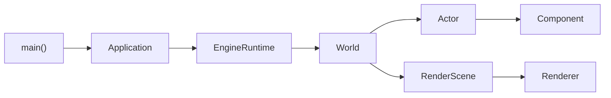
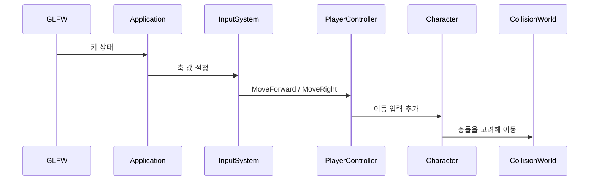

# 여기서 시작하기

처음 코드를 보는 칭구를 위한 출발점이다. 모든 파일을 한꺼번에 이해하려 하지
않아도 된다. 먼저 **한 프레임이 어디서 시작해 어디로 전달되는지**만 따라가자.

## 이 엔진을 한 문장으로

`Application`이 창과 반복문을 관리하고, `EngineRuntime`이 실행 모드를 고르며,
`World`가 `Actor`와 `Component`를 업데이트하는 작은 3D 엔진이다.

## 첫 번째 산책: main에서 World까지

1. `src/main.cpp`의 `main`
   - 프로그램의 가장 작은 입구다.
   - `Application`을 만들고 `run`을 호출한다.
2. `include/engine/Application.hpp`의 `Application`
   - GLFW 창, OpenGL 컨텍스트, 게임 루프를 소유한다.
3. `src/Application.cpp`의 `Application::run`
   - 실제 시간과 고정 업데이트 시간을 나눈다.
   - 입력, 업데이트, 렌더링, ImGui를 차례로 처리한다.
4. `include/engine/Gameplay.hpp`의 `EngineRuntime`
   - Edit, Simulate, PlayInEditor 중 현재 상태를 관리한다.
5. `include/engine/World.hpp`의 `World`
   - Actor 생성, Tick, 충돌, 지연 삭제를 책임진다.

여기까지 읽었으면 엔진 전체를 외우지 않아도 큰 길은 이미 잡은 것이다.

에디터 조작부터 체험하고 싶다면
[3D 에디터 첫 실습](03_EDITOR_QUICKSTART.md)을 먼저 따라 해도 좋다.

## 두 번째 산책: 플레이어 이동

다음 순서로 심벌을 찾는다.

1. `Application::updateInput`
2. `InputSystem::setAxisValue`
3. `PlayerController::tick`
4. `Character::addMovementInput`
5. `Character::tick`
6. `CollisionWorld::moveComponent`

## 세 번째 산책: 화면에 큐브가 나오기까지

1. `StaticMeshComponent`가 위치, 크기, 색으로 `RenderProxy`를 만든다.
2. `RenderScene::sync`가 변경된 proxy만 모은다.
3. `Renderer::render`가 OpenGL draw call을 보낸다.

Component가 OpenGL을 직접 호출하지 않는 것이 핵심이다. 게임 구조와 그래픽 API를
분리해 두면 나중에 렌더링 코드를 바꾸기 쉬워진다.

## 다음에 읽을 문서

- 직접 실행하려면 [빌드와 실행](01_BUILD_AND_RUN.md)
- 파일별 읽기 순서는 [코드 읽기 순서](02_CODE_READING_ORDER.md)
- 자동 스크린샷은 [AI 시각 테스트](AI_VISUAL_TESTING.md)
- 낯선 단어는 [용어집](GLOSSARY.md)
- Actor와 Component가 궁금하면
  [World, Actor, Component](modules/world-actor-component.md)

막히면 한 번에 한 함수만 따라가도 괜찮아. 작은 흐름을 여러 번 잇는 것이 엔진
공부의 가장 확실한 방법이야.
