# 3D 에디터 첫 실습

이 문서는 빌드가 끝난 뒤 10분 동안 에디터를 직접 만져 보는 안내서다.
먼저 조작에 익숙해지고, 그다음 코드에서 같은 흐름을 찾아보자.

## 1. 에디터 실행

Visual Studio의 **Developer PowerShell for VS**에서 저장소 루트로 이동한 뒤:

```powershell
cmake --preset windows-debug
cmake --build --preset windows-debug
.\out\build\windows-debug\topdown_engine.exe
```

처음 실행하면 중앙 Viewport, 왼쪽 World Outliner, 오른쪽 Details, 아래쪽
Content Browser와 Output Log가 보인다. 패널은 제목 탭을 끌어 자유롭게 도킹할 수
있고, 배치는 `Saved/Editor/imgui.ini`에 저장된다.

## 2. 카메라 움직이기

| 입력 | 동작 |
| --- | --- |
| `RMB` 드래그 | 카메라 시점 회전 |
| `RMB + W/A/S/D` | 앞/왼쪽/뒤/오른쪽 이동 |
| `RMB + Q/E` | 아래/위 이동 |
| `Shift` | 빠르게 이동 |
| `Alt + LMB` 드래그 | 선택한 물체 중심으로 회전 |
| `MMB` 드래그 | 화면 평행 이동 |
| 마우스 휠 | 앞뒤 이동 |
| `F` | 선택한 물체에 초점 맞추기 |

카메라는 Edit와 Simulate에서만 에디터 카메라를 사용한다. PIE에서는
`CameraComponent`가 제공하는 게임 카메라로 바뀐다.

## 3. 물체 선택하고 바꾸기

1. Viewport의 큐브를 왼쪽 클릭한다.
2. 선택된 물체에 노란 wireframe과 Transform 기즈모가 나타나는지 확인한다.
3. `W`, `E`, `R`로 이동, 회전, 크기 기즈모를 바꾼다.
4. Toolbar의 `Local`과 `Snap`을 켜고 끄며 차이를 확인한다.
5. Details의 Location, Rotation, Scale 숫자를 직접 드래그해 본다.

Snap 간격은 이동 `10cm`, 회전 `15도`, 크기 `0.1`이다. 기즈모와 Details의
연속 드래그는 마우스를 놓을 때 하나의 Undo 항목으로 기록된다.

## 4. Actor 만들고 정리하기

| 입력 또는 버튼 | 동작 |
| --- | --- |
| `Add > Empty Actor` | 빈 Actor와 Root SceneComponent 생성 |
| `Add > Cube Actor` | mesh와 collision을 가진 큐브 생성 |
| `Ctrl+D` | 선택 Actor 복제 |
| `Delete` | 선택 Actor 삭제 |
| `Undo`, `Redo` | 마지막 편집 되돌리기 또는 다시 적용 |

생성, 변형, 복제, 삭제는 Edit 모드에서만 가능하다. 이름이 겹치면 `Cube`,
`Cube 2`, `Cube 3`처럼 자동으로 정리된다.

## 5. Edit와 PIE 비교하기

1. Edit에서 큐브 하나를 옮긴다.
2. `F5`로 PIE를 시작한다.
3. 플레이어를 `W/A/S/D`로 움직인다.
4. 다시 `F5`를 눌러 Edit로 돌아온다.

PIE 중 변화가 원본 Edit World에 남지 않으면 정상이다. PIE는 World를 JSON으로
복제하고, 종료할 때 복제본을 버린다.

## 입력에서 화면까지

```mermaid
flowchart LR
    Input["마우스와 키보드"] --> App["Application::drawViewportPanel"]
    App --> Controller["EditorViewportController"]
    Controller --> Camera["CameraView / EditorRay"]
    Camera --> Pick["pickRenderProxy"]
    Pick --> Selection["선택 Actor GUID"]
    Selection --> Gizmo["ImGuizmo"]
    Gizmo --> Transform["SceneComponent Transform"]
    Transform --> Scene["RenderScene::sync"]
    Scene --> Target["ViewportRenderTarget"]
```



## 코드 따라가기

1. `include/engine/Editor.hpp`의 `EditorViewportController`를 읽는다.
2. `src/Editor.cpp`의 `update`, `focus`, `screenRay`를 읽는다.
3. `src/Application.cpp`의 `drawViewportPanel`과 `updateEditorCamera`를 읽는다.
4. `selectFromViewport`에서 ray가 `pickRenderProxy`로 전달되는지 확인한다.
5. `drawTransformGizmo`와 `TransactionStack::recordTransform`을 연결해 읽는다.

## 흔한 실수

- Viewport가 아닌 Details 위에서 카메라 키를 누른다.
- PIE에서 물체를 편집하려고 한다.
- `Alt + LMB`와 일반 선택 클릭을 동시에 기대한다.
- 선택한 Actor가 아닌 자식 Component의 상대 Transform을 보고 혼동한다.
- cm 단위를 m로 생각해 `1`만 이동시키고 변화가 거의 없다고 느낀다.

## 관련 테스트

`tests/EngineTests.cpp`의 `testEditorViewportMath`,
`testRenderProxyPicking`, `testWorldRestoreAndSnapshotTransactions`가 카메라,
선택, 구조 편집 Undo/Redo의 핵심 규칙을 확인한다.
