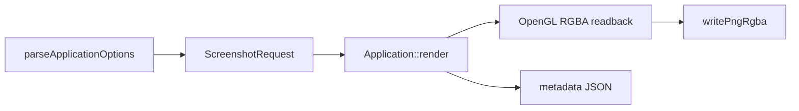

# AI 시각 테스트

에디터를 사람이 직접 열지 않아도 정해진 프레임의 PNG와 JSON metadata를
만드는 방법이다. 화면 회귀를 찾거나 AI에게 현재 UI를 보여 줄 때 사용한다.

## 가장 작은 실행

```powershell
.\out\build\windows-debug\topdown_engine.exe `
  --capture Saved/Screenshots/smoke.png `
  --capture-target both `
  --capture-frame 3 `
  --exit-after-capture `
  --window-size 1440x810 `
  --hidden
```

생성 파일:

```text
Saved/Screenshots/smoke-editor.png
Saved/Screenshots/smoke-editor.json
Saved/Screenshots/smoke-viewport.png
Saved/Screenshots/smoke-viewport.json
```

`both`는 지정한 파일명에 `-editor`, `-viewport` 접미사를 붙인다. `editor` 또는
`viewport` 하나만 고르면 지정한 stem을 그대로 사용한다.

## CLI 옵션

| 옵션 | 뜻 |
| --- | --- |
| `--capture <path>` | PNG 기준 경로 |
| `--capture-target editor\|viewport\|both` | 캡처 범위 |
| `--capture-frame <N>` | N번째 렌더 프레임에 캡처 |
| `--exit-after-capture` | 캡처 뒤 정상 종료 |
| `--window-size <WIDTH>x<HEIGHT>` | 에디터 창 해상도 |
| `--hidden` | 창을 표시하지 않고 OpenGL 실행 |

경로나 framebuffer 캡처가 실패하면 stderr와 Output Log에 이유를 남기고
종료 코드 `2`를 반환한다. 잘못된 CLI 값은 프로그램 시작 전에 오류가 된다.

## Metadata 읽기

JSON에는 다음 정보가 들어 있다.

- World 이름과 Edit/Simulate/PIE 모드
- PNG width와 height
- 선택 객체 GUID와 이름
- 에디터 카메라 위치, yaw, pitch
- Actor 수
- editor 또는 viewport 대상

이미지를 비교할 때 metadata도 함께 보면 창 크기나 카메라 차이를 화면 결함으로
잘못 판단하는 일을 줄일 수 있다.

## 판독 체크리스트

1. editor PNG에 Toolbar, Outliner, Viewport, Details, 하단 패널이 모두 있는가?
2. viewport PNG가 UI 없이 3D 장면만 포함하는가?
3. 바닥 격자와 큐브가 잘리지 않고 보이는가?
4. 선택 객체에 노란 wireframe이 보이는가?
5. metadata의 해상도, 선택 이름, Actor 수가 이미지와 맞는가?
6. 이미지가 상하로 뒤집히지 않았는가?

## 코드 따라가기



- `include/engine/Editor.hpp`: 옵션과 캡처 데이터 구조
- `src/Editor.cpp`: CLI 파싱
- `src/Application.cpp`: 프레임 예약, readback, metadata
- `src/Screenshot.cpp`: PNG 저장과 상하 반전
- `src/Renderer.cpp`: editor backbuffer와 viewport framebuffer readback

## 자동화에서 주의할 점

- configure 직후 첫 실행은 의존성 다운로드가 아니라 이미 빌드된 실행 파일을 쓴다.
- UI가 안정되기 전에 찍히지 않도록 보통 `--capture-frame 3` 이상을 사용한다.
- `Saved/`는 Git에서 제외되므로 결과물을 커밋하지 않는다.
- 실패 종료 코드를 무시하지 않는다.
