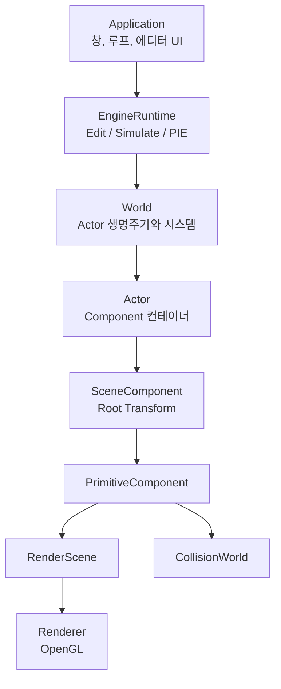
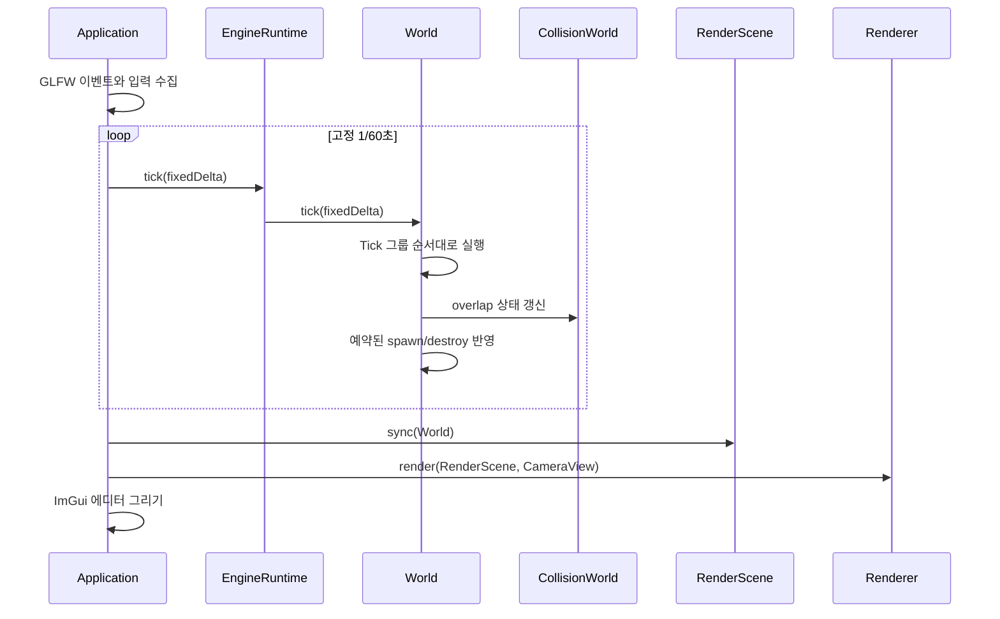
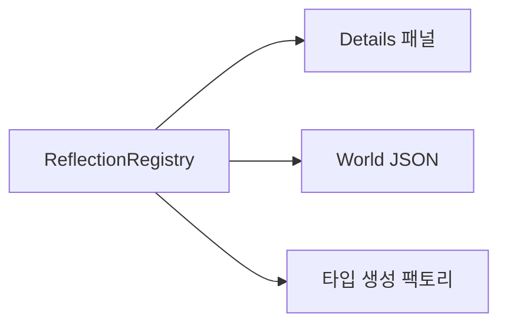
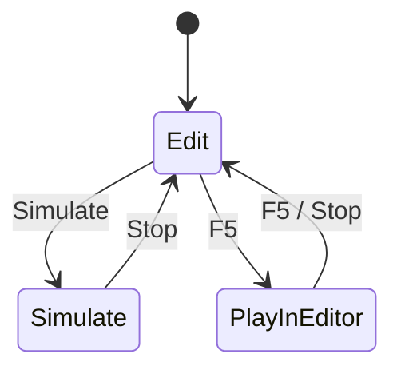

# 전체 아키텍처

## 설계 목표

이 엔진은 Unreal Engine의 핵심 개념을 작은 코드로 연습한다. 성능과 기능의
완전한 복제가 아니라 다음 질문에 답할 수 있는 구조를 우선한다.

- 객체를 누가 만들고 언제 없애는가?
- 위치와 회전은 부모에게서 어떻게 이어지는가?
- 게임 로직과 렌더링은 어디서 분리되는가?
- 편집 중인 World를 망가뜨리지 않고 어떻게 실행하는가?

## 계층 지도



## 소유권

| 소유자 | 소유 대상 | 수명 규칙 |
| --- | --- | --- |
| `Application` | `EngineRuntime`, `Renderer` | 프로그램 시작부터 종료까지 |
| `EngineRuntime` | `GameInstance`, Edit/PIE `World` | 모드 전환에 따라 World 교체 |
| `World` | `Actor` | `destroyActor` 요청 후 프레임 끝에 삭제 |
| `Actor` | `ActorComponent` | Actor와 함께 등록되고 삭제 |
| `SceneComponent` | 자식 연결 정보 | 객체를 소유하지 않고 계층만 연결 |
| `RenderScene` | `RenderProxy` 값 복사본 | Component revision에 맞춰 갱신 |

`Object::getOuter`는 소유 관계를 찾아가는 공통 포인터다. 실제 메모리 소유는
`std::unique_ptr` 컨테이너가 담당한다.

## 좌표계와 Transform

- `X`: 앞
- `Y`: 오른쪽
- `Z`: 위
- 거리 1단위: 1cm
- 회전 저장: degree 단위 Euler 각
- 행렬 결합: 부모 World Transform과 자식 Local Transform의 곱

Actor는 Transform을 직접 갖지 않는다. Actor의 `RootComponent`가 Actor의
공간상 위치 역할을 한다. 다른 `SceneComponent`는 Root 또는 다른
SceneComponent에 attach된다.

## 한 프레임



렌더 프레임 속도가 달라도 게임 규칙은 고정된 시간 간격으로 갱신된다. 한 화면
프레임이 느리면 고정 업데이트가 여러 번 실행될 수 있다.

## 생명주기

Actor의 기본 순서는 다음과 같다.

```text
생성
-> OnConstruction
-> RegisterComponents
-> BeginPlay
-> Tick
-> EndPlay
-> 삭제
```

Tick 도중 컨테이너를 바로 바꾸면 반복자가 무효화될 수 있다. 그래서 World는
Tick 중 생성과 삭제를 예약하고 그룹 실행이 끝난 뒤 반영한다.

## Tick 그룹

1. `PrePhysics`: 입력과 이동 의도
2. `Physics`: 충돌과 물리 성격의 갱신
3. `PostPhysics`: 물리 결과에 의존하는 처리
4. `PostUpdate`: 카메라와 최종 후처리 성격의 갱신

Actor와 Component Tick은 기본적으로 꺼져 있다. 필요한 타입만 활성화하고,
`TickSettings::interval`로 호출 간격을 늘릴 수 있다.

## Reflection

`ReflectionRegistry`에는 `TypeDescriptor`와 `PropertyDescriptor`를 코드로
직접 등록한다. 헤더 생성기나 매크로는 사용하지 않는다.

같은 프로퍼티 정보가 두 곳에서 쓰인다.



## 렌더링 경계

`PrimitiveComponent`는 OpenGL을 모른다. 상태가 바뀌면 revision을 올리고 불변
값 묶음인 `RenderProxy`를 만든다. `RenderScene`은 revision이 변한 항목만
교체하고, `Renderer`만 OpenGL API를 호출한다.

현재는 한 스레드지만 이 경계 덕분에 게임 객체와 렌더 데이터를 구분해 학습할
수 있다.

## 충돌 경계

`BoxComponent`가 World AABB와 collision channel/response를 제공하고,
`CollisionWorld`가 query를 수행한다. 현재 회전된 상자도 넓게 감싸는 AABB로
처리하며 sweep는 고정 단계의 교육용 구현이다.

## Edit와 PIE



PIE를 시작하면 Edit World를 JSON으로 직렬화한 뒤 새 World로 역직렬화한다.
플레이 중 변경은 복제본에만 남고 종료할 때 폐기된다.

## 더 읽기

- [Core와 Reflection](modules/core-and-reflection.md)
- [World, Actor, Component](modules/world-actor-component.md)
- [게임 루프와 입력](modules/game-loop-and-input.md)
- [렌더링](modules/rendering.md)
- [충돌](modules/collision.md)
- [게임플레이 도구](modules/gameplay-tools.md)
- [에디터와 PIE](modules/editor-and-pie.md)
- [에셋과 직렬화](modules/assets-and-serialization.md)
