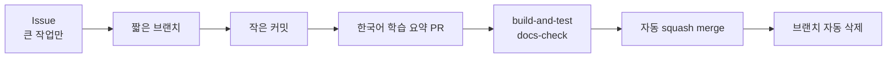

# Git 작업 흐름

이 저장소는 장기 `develop` 브랜치 없이 짧은 기능 브랜치를 `main`에 합치는
GitHub Flow를 사용한다.

## 한 작업의 흐름



## 브랜치 이름

```text
feat/editor-camera
fix/camera-rotation
docs/rendering-guide
refactor/collision-query
test/world-lifecycle
chore/github-setup
```

브랜치는 한 가지 목적만 담는다. 며칠 이상 커진다면 기능을 더 작은 완료 단위로
나눌 수 있는지 먼저 확인한다.

## 커밋과 PR 제목

```text
feat: 에디터 카메라 이동 추가
fix: 카메라 회전축 계산 수정
docs: 렌더링 흐름 문서화
refactor: 충돌 query 책임 분리
test: PIE 월드 격리 테스트 추가
chore: GitHub 설정 정리
```

PR은 squash되므로 **PR 제목이 main에 남는 최종 커밋 메시지**가 된다.

## Issue가 필요한 경우

- 여러 PR로 나뉘는 기능
- 아키텍처 변경
- 재현과 조사 단계가 필요한 버그
- `breaking-change`가 될 수 있는 작업

작은 문서 수정, 테스트 보강, 원인이 명확한 버그는 바로 브랜치와 PR로 시작해도
된다.

## main 보호 규칙

- PR과 `build-and-test`, `docs-check` 성공이 필요하다.
- merge 전에 최신 `main`을 반영한다.
- 해결되지 않은 대화가 있으면 merge하지 않는다.
- force push와 브랜치 삭제를 금지한다.
- 1인 학습 프로젝트 동안 필수 타인 승인은 0명이다.
- 협업자가 생기면 승인 1명과 `CODEOWNERS`를 추가한다.

## 릴리스

1. `CMakeLists.txt` 프로젝트 버전을 정한다.
2. `CHANGELOG.md`의 Unreleased 항목을 같은 버전과 날짜로 옮긴다.
3. main CI 성공을 확인한다.
4. `vX.Y.Z` Git 태그와 같은 이름의 GitHub Release를 만든다.

버전 파일, changelog, 태그가 서로 다르면 릴리스하지 않는다.

## 운영 검증 기록

- 2026-06-14: 최초 `main` 기준선에서 `build-and-test`와 `docs-check` 성공
- 2026-06-14: `docs/verify-workflow` 문서 PR로 자동 squash merge와 원격 브랜치
  자동 삭제 검증
