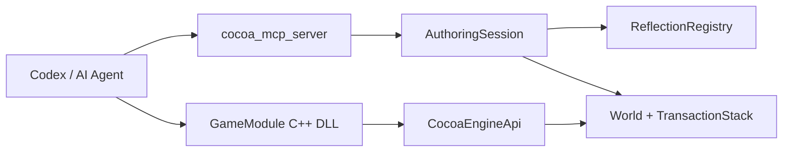

# AI Authoring 계층

## 목표

AI가 C++ 내부 구현을 추측하지 않고 `ReflectionRegistry -> AuthoringSession -> MCP` 계약을
통해 프로젝트를 읽고 편집하게 한다. 동일한 명령은 preview, 실제 적용, Undo/Redo,
World 저장에 재사용된다.

## 핵심 타입

- [`ProjectManifest`](../../include/engine/Authoring.hpp): 프로젝트 경로와 승인된 빌드 preset
- [`AuthoringSession`](../../include/engine/Authoring.hpp): schema 조회와 원자적 World 명령
- [`McpServer`](../../include/engine/McpServer.hpp): stdio JSON-RPC MCP 처리
- [`GameModuleHost`](../../include/engine/GameModule.hpp): C ABI gameplay DLL 로더

## 흐름도

## 코드 따라가기

1. `CocoaProject.json`에서 프로젝트 경계와 preset을 본다.
2. `AuthoringSession::preview`와 `apply`의 snapshot 차이를 읽는다.
3. `AuthoringSession::execute`에서 alias, type factory, property setter가 연결되는지 본다.
4. `McpServer::handle`의 initialize, tools/list, tools/call 흐름을 확인한다.
5. `GameModuleHost::load`에서 ABI version과 export 검증을 읽는다.

## 관련 테스트

- `testAuthoringCommandsAreAtomicAndRevisioned`
- `testMcpProtocolAndApprovalScopes`
- `testGameModuleAbiLoadsSampleDll`

현재 live editor named pipe는 capability에 planned로 표시한다. 오프라인 명령 계약을 먼저
고정한 뒤 같은 `AuthoringSession` 실행기를 에디터 main thread queue에 연결한다.
