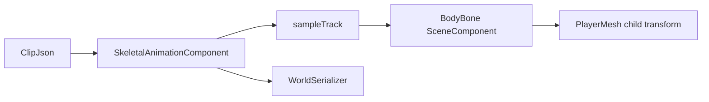

# 애니메이션

## 목표

v0.9의 첫 애니메이션 단계는 스킨드 메시 렌더링이 아니라, `SceneComponent`를 bone처럼
사용하는 교육용 skeletal animation이다. 이름 붙은 bone component에 JSON keyframe clip을
적용해서 Transform 계층과 Tick, reflection, World 저장/로드가 애니메이션과 어떻게
연결되는지 먼저 익힌다.

## 필요한 이유

실제 게임 엔진의 skeletal animation은 bone, pose, clip, sampling, skinning, GPU upload가
모두 엮인다. 처음부터 전부 만들면 구조를 읽기 어렵다. 그래서 지금 단계에서는
`SkeletalAnimationComponent`가 clip을 샘플링하고, 같은 Actor 안의 `SceneComponent`를
이름으로 찾아 relative Transform을 바꾸는 방식으로 핵심 흐름만 만든다.

## 핵심 타입

- [`SkeletalAnimationComponent`](../../include/engine/Gameplay.hpp): JSON clip을 파싱하고 Tick마다 bone pose를 적용한다.
- [`SceneComponent`](../../include/engine/World.hpp): bone 역할을 하며 부모-자식 Transform을 가진다.
- [`Character`](../../include/engine/Gameplay.hpp): 기본 `BodyBone`과 idle animation clip을 만든다.
- [`Reflection.cpp`](../../src/Reflection.cpp): `ClipJson`, `Playing`, `PlaybackTime` property를 등록한다.

## 흐름도

## 코드 따라가기

1. [`Gameplay.hpp`](../../include/engine/Gameplay.hpp)의 `SkeletalAnimationComponent` 공개 API를 읽는다.
2. [`Gameplay.cpp`](../../src/Gameplay.cpp)의 `SkeletalAnimationComponent::rebuildClip`에서 JSON을 track/keyframe으로 바꾸는 과정을 본다.
3. `SkeletalAnimationComponent::applyPose`에서 bone 이름으로 `SceneComponent`를 찾고 Transform을 적용하는 흐름을 확인한다.
4. `Character::onConstruction`에서 `BodyBone`, `PlayerMesh`, 기본 idle clip이 어떻게 연결되는지 본다.
5. [`Reflection.cpp`](../../src/Reflection.cpp)에서 애니메이션 property가 Details와 저장 시스템에 등록되는 방식을 확인한다.

## 실험 과제

`Character::onConstruction`의 기본 clip에서 `rotation` 값을 `-3/3`에서 `-12/12`로 바꿔
캐릭터 idle 흔들림이 더 커지는지 확인한다. 그 다음 `loop`를 `false`로 바꾸면 마지막
키프레임에서 멈추는지도 살펴본다.

## 흔한 실수

- bone 이름이 component 이름과 정확히 같지 않으면 pose가 적용되지 않는다.
- keyframe의 `time`을 정렬하지 않고 사용하면 보간 구간이 꼬인다. 현재 구현은 파싱 후 정렬한다.
- 이 단계는 mesh skinning이 아니다. child mesh 전체가 bone Transform을 따라 움직이는 교육용 구조다.
- Tick이 꺼져 있으면 자동 재생되지 않는다. 수동 검증에는 `applyPose`를 직접 호출할 수 있다.

## 관련 테스트

[`EngineTests.cpp`](../../tests/EngineTests.cpp)의 `testSkeletalAnimationAppliesBonePose`는
bone pose 보간, clip 길이 파싱, World JSON 저장/로드를 확인한다.
`testCharacterCreatesAnimatedBodyBone`은 기본 Character가 `BodyBone`과 animation component를
만들고 Tick에서 pose를 적용하는지 확인한다.
