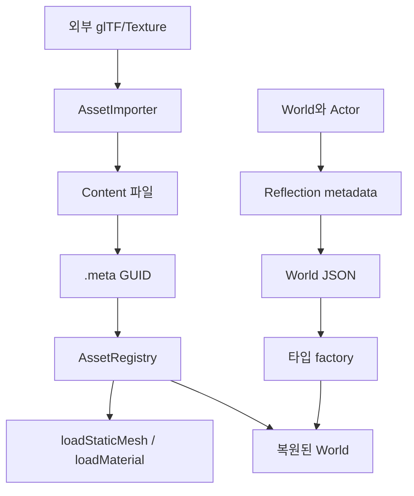

# Asset과 Serialization

## v0.7 Texture Asset 흐름

`AssetImporter::importTexture`는 외부 이미지 파일을 `Content/Imported/Textures`
아래로 복사하고, `.texture.json`과 `.meta`를 만든다. 이후
`AssetRegistry::loadTexture`는 GUID로 이 JSON을 찾아 `TextureAsset`을 반환한다.

`TextureAsset`은 아직 GPU 객체가 아니라 CPU 쪽 설명서에 가깝다. 실제 OpenGL
texture는 렌더러가 필요할 때 `Renderer::textureFor`에서 한 번 생성하고 캐시에
보관한다. 이렇게 나누면 Content 스캔은 빠르게 끝나고, GPU 리소스는 화면에
필요해지는 순간에만 만들어진다.

## 목표

Content 폴더의 파일을 GUID로 식별하고, World 객체와 프로퍼티를 JSON으로
저장하고 다시 만드는 과정을 이해한다.

## 필요한 이유

경로만 저장하면 파일 이름이나 폴더가 바뀔 때 모든 참조가 깨진다. 안정적인
GUID와 reflection 기반 저장은 에디터 확장의 기초가 된다.

## 핵심 타입

- [`AssetData`](../../include/engine/Systems.hpp): GUID와 경로 메타데이터
- [`AssetRegistry`](../../include/engine/Systems.hpp): `.meta` 스캔과 조회
- [`AssetImporter`](../../include/engine/Systems.hpp): 외부 glTF와 texture를 Content 에셋으로 등록
- [`StaticMeshAsset`, `MaterialAsset`](../../include/engine/Systems.hpp): JSON에서 읽은 CPU 에셋 값
- [`WorldSerializer`](../../include/engine/Systems.hpp): World JSON 왕복
- [`ReflectionRegistry`](../../include/engine/Core.hpp): 저장할 타입과 프로퍼티

## 흐름도

## 코드 따라가기

1. [`Content/Meshes/Cube.asset.json.meta`](../../Content/Meshes/Cube.asset.json.meta)
   에서 에셋 GUID 형식을 본다.
2. [`Systems.cpp`](../../src/Systems.cpp)의 `AssetRegistry::scan`에서 `.meta`
   검색과 등록을 읽는다.
3. `AssetImporter::importGltfAsStaticMesh`와 `importTexture`에서 외부 파일을
   `Content/Imported/` 아래로 복사하고 `.meta`를 만드는 과정을 읽는다.
4. `AssetRegistry::loadStaticMesh`와 `loadMaterial`에서 GUID로 source JSON을
   여는 과정을 읽는다.
5. `WorldSerializer::toJson`에서 타입, GUID, 프로퍼티 저장을 확인한다.
6. `WorldSerializer::fromJson`에서 타입 factory와 기본값 처리를 읽는다.
7. 모든 객체를 만든 뒤 attachment를 연결하는 두 번째 단계를 찾는다.

## 실험 과제

World를 저장하고 Actor 이름과 Transform을 바꾼 뒤 다시 로드한다. 저장 시점 값과
GUID가 복원되는지 JSON 파일과 Outliner에서 비교한다.

## 흔한 실수

- 에셋 참조에 절대 파일 경로를 저장한다.
- 알 수 없는 프로퍼티 하나 때문에 전체 로드를 실패시킨다.
- 부모 객체보다 자식을 먼저 연결하려 한다.
- 저장 중인 실행 상태와 편집 가능한 프로퍼티를 구분하지 않는다.
- `.meta` 파일을 Git에서 빠뜨린다.
- `.meta`의 type과 source JSON의 type을 검증하지 않고 아무 타입으로 로드한다.
- importer가 만든 원본 복사본이 아니라 외부 절대 경로를 에셋 JSON에 저장한다.

## 관련 테스트

[`EngineTests.cpp`](../../tests/EngineTests.cpp)의
`testReflectionAndSerialization`이 GUID, 타입, Transform과 프로퍼티의
저장/로드 왕복을 확인한다. `testAssetRegistryLoadsGuidAssets`는 `.meta` 스캔,
GUID/name/type 조회, StaticMesh와 Material JSON 로드를 확인한다.
`testAssetImporterCreatesMetaFiles`는 glTF와 texture importer가 source JSON,
원본 복사본, `.meta`를 만들고 Registry에서 다시 찾을 수 있는지 확인한다.
