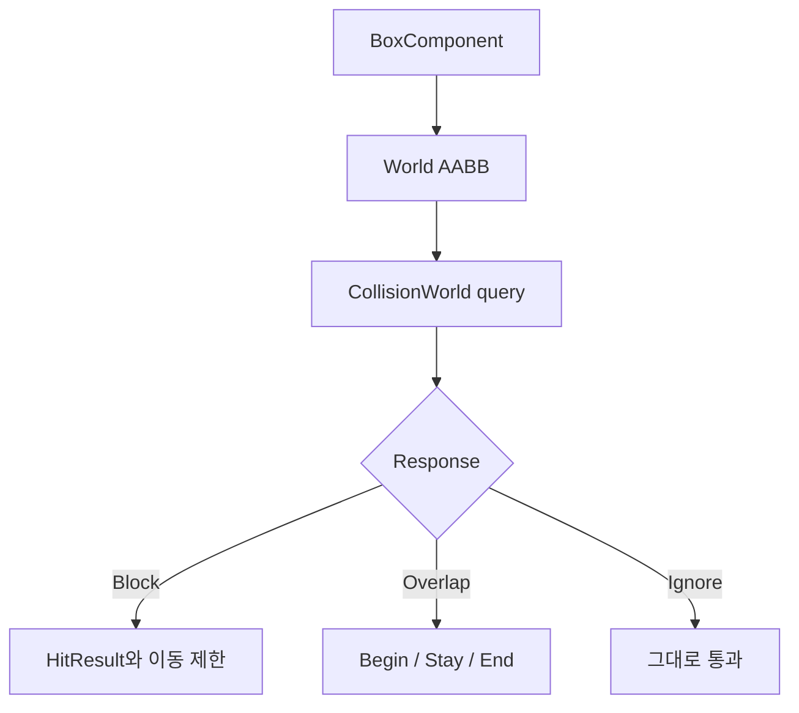

# 충돌

## v0.8 Collision Channel 편집

`BoxComponent`를 선택하면 Details 패널에서 `ObjectChannel`을 숫자가 아니라
`WorldStatic`, `WorldDynamic`, `Pawn`, `Visibility`, `Camera` 콤보로 바꿀 수 있다.
내부 저장은 reflection 호환을 위해 integer property를 그대로 사용하지만, UI는
초보자가 채널 의미를 바로 볼 수 있게 이름으로 보여준다.

## v0.8 Step Movement

`CollisionWorld::moveComponentStepped`는 일반 `moveComponent`가 수평 이동에서
막혔을 때 `stepHeight`만큼 위로 올려 다시 수평 이동을 시도한다. 성공하면 작은
간격으로 아래로 내려오며 가능한 가장 낮은 위치에 캐릭터를 둔다. 아직 완전한
캐릭터 컨트롤러는 아니지만, 낮은 턱과 계단을 처리하는 기본 아이디어를 보여준다.

## 목표

BoxComponent가 만드는 AABB와 Block/Overlap/Ignore 응답, query와 이동 해결 과정을
이해한다.

## 필요한 이유

플레이어가 벽을 통과하지 않게 하는 이동과, 범위 감지처럼 통과는 허용하되
이벤트가 필요한 기능은 서로 다른 응답을 요구한다.

## 핵심 타입

- [`BoxComponent`](../../include/engine/Components.hpp): 크기와 충돌 설정
- [`AABB`](../../include/engine/Systems.hpp): 최소/최대점 충돌 도형
- [`CollisionWorld`](../../include/engine/Systems.hpp): overlap, raycast, sweep, 이동
- [`HitResult`](../../include/engine/Systems.hpp): 충돌 지점, 법선, 대상
- [`OverlapEvent`](../../include/engine/Systems.hpp): Begin, Stay, End 상태

## 흐름도

## 코드 따라가기

1. [`Components.cpp`](../../src/Components.cpp)의 `BoxComponent::getWorldAABB`에서
   Transform과 half extent가 경계로 바뀌는 과정을 읽는다.
2. [`Systems.cpp`](../../src/Systems.cpp)의 `CollisionWorld::overlap`을 본다.
3. `CollisionWorld::raycast`에서 가장 가까운 hit 선택을 찾는다.
4. `CollisionWorld::sweep`의 고정 단계 탐색을 확인한다.
5. `CollisionWorld::moveComponent`에서 축별 이동과 slide 결과를 읽는다.
6. overlap pair가 프레임 사이에 어떻게 Begin/Stay/End로 분류되는지 본다.

## 실험 과제

벽 하나를 `Overlap`으로 바꾼다. 플레이어가 통과하면서 Begin, Stay, End 이벤트가
차례로 발생하는지 Output Log로 확인한다.

## 흔한 실수

- 회전된 Box가 OBB로 정확히 충돌한다고 생각한다.
- 양쪽 response를 함께 고려하지 않는다.
- ray 방향을 정규화하지 않는다.
- sweep를 연속 충돌 검출처럼 완전하다고 가정한다.
- overlap pair의 순서를 고정하지 않아 같은 두 객체를 다른 pair로 저장한다.

## 관련 테스트

[`EngineTests.cpp`](../../tests/EngineTests.cpp)의 `testCollision`이 overlap,
raycast, sweep와 이동 차단을 확인한다.
