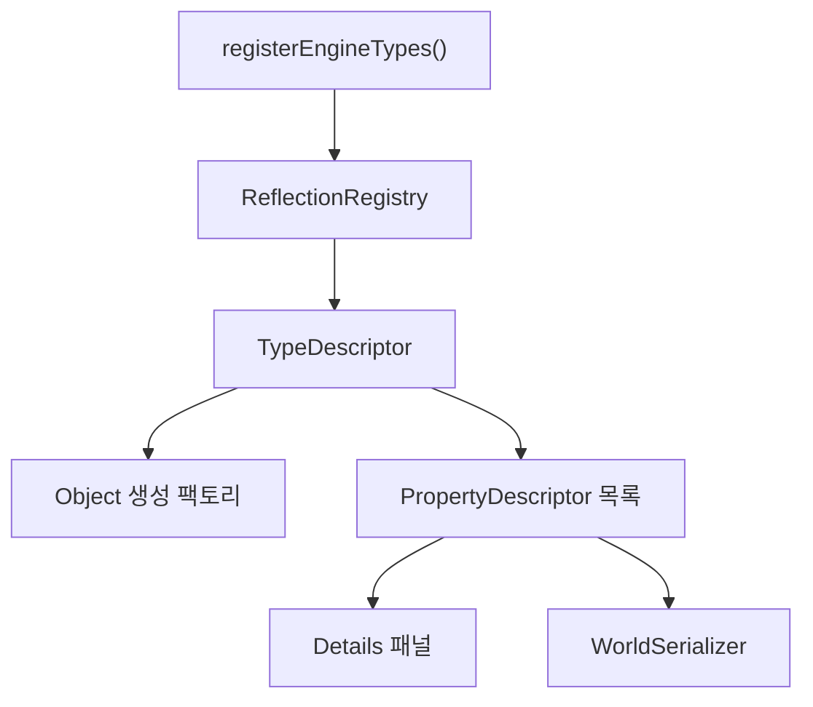

# Core와 Reflection

## 목표

모든 엔진 객체의 공통 기반과, 타입/프로퍼티 정보를 실행 중에 읽는 방법을
이해한다.

## 필요한 이유

Details 패널과 World 저장 기능이 각각 프로퍼티 목록을 따로 알고 있다면 변경할
때 쉽게 어긋난다. reflection은 한 번 등록한 정보를 편집과 저장이 함께 쓰게 한다.

## 핵심 타입

- [`Guid`](../../include/engine/Core.hpp): 저장 후 다시 열어도 객체를 식별하는 ID
- [`Transform`](../../include/engine/Core.hpp): cm 위치, degree 회전, 크기
- [`Object`](../../include/engine/Core.hpp): GUID, 이름, Outer, 타입 정보의 기반
- [`TypeDescriptor`](../../include/engine/Core.hpp): 타입 이름, 부모, 팩토리
- [`PropertyDescriptor`](../../include/engine/Core.hpp): 프로퍼티 접근과 편집/저장 규칙
- [`ReflectionRegistry`](../../include/engine/Core.hpp): descriptor 중앙 저장소

## 흐름도

## 코드 따라가기

1. [`Core.hpp`](../../include/engine/Core.hpp)에서 descriptor 구조를 읽는다.
2. [`Reflection.cpp`](../../src/Reflection.cpp)의 `registerEngineTypes`에서 실제
   타입과 프로퍼티 등록 예를 본다.
3. [`Core.cpp`](../../src/Core.cpp)의 `ReflectionRegistry::find`와
   `Object::getTypeDescriptor`를 따라간다.
4. [`Application.cpp`](../../src/Application.cpp)의 Details 그리기에서
   `PropertyDescriptor`가 UI가 되는 부분을 찾는다.
5. [`Systems.cpp`](../../src/Systems.cpp)의 `WorldSerializer`에서 같은 정보가
   JSON 저장에 사용되는지 확인한다.

## 실험 과제

`Actor`에 학습용 문자열 프로퍼티를 하나 추가하고 reflection에 등록한다. Details
패널과 저장된 JSON 양쪽에 나타나는지 확인한다.

## 흔한 실수

- C++ 멤버를 추가하고 reflection 등록을 잊는다.
- 저장하면 안 되는 실행 중 상태에 `save` 플래그를 켠다.
- factory가 올바른 `Outer` 또는 `World`를 전달하지 않는다.
- GUID를 화면 표시용 이름처럼 자주 새로 만든다.

## 관련 테스트

[`EngineTests.cpp`](../../tests/EngineTests.cpp)의 `testGuid`와
`testReflectionAndSerialization`이 GUID와 reflection 왕복을 확인한다.
