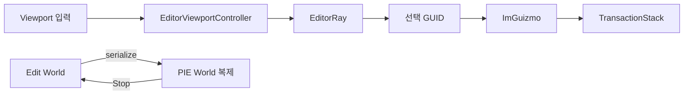

# Editor와 Play In Editor

## 목표

하나의 실행 파일에서 장면을 선택·변형하고 Edit, Simulate, PlayInEditor 상태를
전환하면서 편집 World를 보존하는 방법을 이해한다.

## 필요한 이유

레벨을 편집한 뒤 실행해 보면서 생긴 임시 위치와 상태가 원본에 남으면 작업물이
망가진다. PIE는 원본을 복제해 안전하게 시험하는 흐름이다.

## 핵심 타입

- [`EngineRuntime`](../../include/engine/Gameplay.hpp): 모드와 World 전환
- [`EditorMode`](../../include/engine/Gameplay.hpp): Edit, Simulate, PlayInEditor
- [`Application`](../../include/engine/Application.hpp): ImGui 패널과 viewport
- [`EditorViewportController`](../../include/engine/Editor.hpp): 편집 카메라와 ray
- [`WorldSerializer`](../../include/engine/Systems.hpp): PIE 복제 경계
- [`TransactionStack`](../../include/engine/Systems.hpp): 편집 Undo/Redo

## 흐름도

## 코드 따라가기

1. [`Gameplay.cpp`](../../src/Gameplay.cpp)의 `EngineRuntime::startPlayInEditor`에서
   World 복제와 BeginPlay를 확인한다.
2. `EngineRuntime::stop`에서 PIE 복제본 폐기를 확인한다.
3. [`Editor.cpp`](../../src/Editor.cpp)의 `EditorViewportController::update`,
   `screenRay`, `pickRenderProxy`를 읽는다.
4. [`Application.cpp`](../../src/Application.cpp)의 `drawViewportPanel`에서
   framebuffer 표시, 카메라 입력, 선택, 기즈모 순서를 찾는다.
5. `drawTransformGizmo`가 Actor의 RootComponent Transform을 바꾸고 드래그가
   끝날 때 `recordTransform`을 호출하는지 확인한다.
6. `createCubeActor`, `duplicateSelection`, `deleteSelection`이 편집 전후 World
   JSON을 `recordSnapshot`에 전달하는지 확인한다.

## 실험 과제

Edit에서 큐브를 만들고 이동한 뒤 Undo/Redo한다. 이어서 PIE에서 플레이어를
이동하고 종료한다. 생성·변형은 되돌릴 수 있고 PIE 이동은 Edit에 남지 않아야 한다.

## 흔한 실수

- Simulate도 복제 World를 사용한다고 생각한다. 현재 Simulate는 Edit World를 실행한다.
- 선택한 Actor 포인터를 PIE 전환 뒤에도 그대로 사용한다.
- 복제할 때 GUID와 attachment 복원을 빼먹는다.
- UI 편집을 Transaction 없이 직접 적용해 Undo가 동작하지 않는다.
- 기즈모 드래그 중 매 프레임 Transaction을 기록해 Undo가 수십 번 생기게 한다.
- Actor 삭제 후 Controller의 possessed Pawn 포인터를 그대로 둔다.

## 관련 테스트

[`EngineTests.cpp`](../../tests/EngineTests.cpp)의 `testPieIsolation`,
`testEditorViewportMath`, `testRenderProxyPicking`,
`testWorldRestoreAndSnapshotTransactions`를 함께 읽는다.
