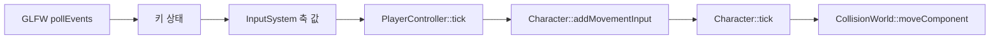

# 게임 루프와 입력

## v0.8 입력 설정 파일

기본 게임 입력은 `Content/Input/default.input.json`에서 읽는다. `axes`는
`MoveForward`처럼 -1부터 1까지 변하는 값을 만들고, `actions`는 `Jump`처럼 눌림
여부만 확인하는 버튼 입력이다.

```json
{
  "axes": [
    {"name": "MoveForward", "positive": "W", "negative": "S"},
    {"name": "MoveRight", "positive": "D", "negative": "A"}
  ],
  "actions": [
    {"name": "Jump", "key": "Space"}
  ]
}
```

`Application::processInput`은 GLFW 키 상태를 `InputSystem`에 넣고,
`PlayerController::tick`은 `MoveForward`, `MoveRight` 축을 읽어 Pawn에 이동
입력을 전달한다.

## 목표

화면 프레임과 고정 업데이트의 차이, 이름 기반 입력 축이 Character 이동으로
전달되는 순서를 이해한다.

## 필요한 이유

게임 규칙을 화면 FPS에 직접 묶으면 컴퓨터 성능에 따라 이동 속도와 충돌 결과가
달라진다. 입력 이름을 사용하면 GLFW 키와 게임플레이 코드를 분리할 수 있다.

## 핵심 타입

- [`Application`](../../include/engine/Application.hpp): 창, 시간, 바깥 반복문
- [`EngineRuntime`](../../include/engine/Gameplay.hpp): 활성 World와 실행 모드
- [`InputSystem`](../../include/engine/Systems.hpp): 축 이름과 키 매핑
- [`PlayerController`](../../include/engine/Gameplay.hpp): 입력을 Pawn 명령으로 변환
- [`Character`](../../include/engine/Gameplay.hpp): 이동 입력을 실제 이동으로 반영

## 흐름도



## 코드 따라가기

1. [`Application.cpp`](../../src/Application.cpp)의 `Application::run`에서
   accumulator와 고정 delta를 찾는다.
2. `Application::updateInput`에서 GLFW 키가 축 값으로 바뀌는 부분을 읽는다.
3. [`Systems.cpp`](../../src/Systems.cpp)의 `InputSystem`에서 axis mapping을 본다.
4. [`Gameplay.cpp`](../../src/Gameplay.cpp)의 `PlayerController::tick`과
   `Character::addMovementInput`을 잇는다.
5. `Character::tick`에서 cm/s 속도와 fixed delta가 이동 거리로 바뀌는지 확인한다.

## 실험 과제

이동 속도를 절반으로 바꾸고 60번의 fixed tick 뒤 이동 거리를 측정한다. 렌더
FPS가 아니라 초당 속도로 계산되는지 확인한다.

## 흔한 실수

- frame delta를 fixed update에 그대로 사용한다.
- 밀린 시간이 너무 클 때 무제한으로 update를 반복한다.
- ImGui가 키보드를 사용 중인데 게임 입력도 함께 처리한다.
- 축 이름 문자열을 여러 곳에 서로 다르게 적는다.

## 관련 테스트

[`EngineTests.cpp`](../../tests/EngineTests.cpp)의
`testCharacterCameraSeesPlayer`가 Character와 카메라 구성의 기본 동작을
확인한다. 입력 매핑이 커지면 별도의 `InputSystem` 단위 테스트를 추가한다.
