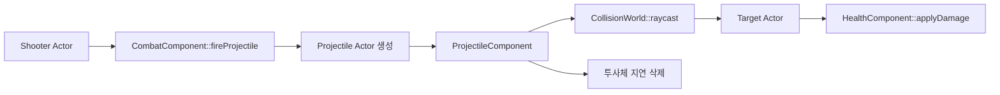

# 게임플레이 도구

## 목표

v0.9의 첫 전투 도구인 체력, 투사체, 전투 컴포넌트가 어떻게 함께 움직이는지
이해한다. 아직 완전한 RPG 전투 시스템은 아니고, “컴포넌트를 조합하면 작은
게임 규칙을 만들 수 있다”는 구조 학습에 초점을 둔다.

## 필요한 이유

Unreal 방식 구조에서는 Actor가 모든 기능을 직접 들고 있기보다, 필요한 기능을
Component로 붙인다. 체력은 `HealthComponent`, 발사는 `CombatComponent`, 날아가는
투사체 규칙은 `ProjectileComponent`가 맡으면 각 책임을 작게 읽고 테스트할 수 있다.

## 핵심 타입

- [`HealthComponent`](../../include/engine/Gameplay.hpp): 최대 체력과 현재 체력을 가진다.
- [`CombatComponent`](../../include/engine/Gameplay.hpp): 방향을 받아 Projectile Actor를 생성한다.
- [`ProjectileComponent`](../../include/engine/Gameplay.hpp): 매 tick 이동하고 raycast로 맞은 대상을 찾는다.
- [`BlueprintComponent`](../../include/engine/Gameplay.hpp): JSON 이벤트 그래프로 reflection property를 읽고 쓴다.
- [`BoxComponent`](../../include/engine/Components.hpp): 투사체와 대상의 간단한 충돌 경계를 제공한다.
- [`CollisionWorld`](../../include/engine/Systems.hpp): raycast 질의를 실행한다.

## 흐름도



## Blueprint-lite 이벤트 그래프

`BlueprintComponent`는 아직 노드 편집 화면이 아니라, 저장 가능한 JSON 그래프를 실행하는
작은 런타임이다. 그래프의 각 node는 `event`, `action`, `target`, `property`, `value`를
가진다. 현재 지원하는 이벤트는 `BeginPlay`와 `Tick`이고, action은 property를 바로
설정하는 `SetProperty`, float property에 값을 더하는 `AddFloat`다.

예를 들어 아래 그래프는 BeginPlay 때 소유 Actor의 `MoveSpeed`를 바꾸고, Tick마다
`HealthComponent.CurrentHealth`를 delta time에 맞춰 조금씩 줄인다.

```json
{
  "nodes": [
    {
      "event": "BeginPlay",
      "action": "SetProperty",
      "target": "Owner",
      "property": "MoveSpeed",
      "value": 720.0
    },
    {
      "event": "Tick",
      "action": "AddFloat",
      "target": "HealthComponent",
      "property": "CurrentHealth",
      "value": -10.0,
      "scaleByDelta": true
    }
  ]
}
```

중요한 점은 property 이름을 직접 C++ 멤버에 연결하지 않는다는 것이다.
`Reflection.cpp`에 등록된 `PropertyDescriptor`를 찾아 setter를 호출하므로, Details
패널과 World 저장/로드가 보는 property 목록을 Blueprint-lite도 함께 사용한다.

## 코드 따라가기

1. [`Gameplay.cpp`](../../src/Gameplay.cpp)의 `CombatComponent::fireProjectile`을
   읽는다. 여기서 투사체 Actor, 충돌 박스, 보이는 큐브, 투사체 로직 컴포넌트가
   한 번에 붙는다.
2. 같은 파일의 `ProjectileComponent::tickComponent`를 읽는다. 현재 위치에서 이동할
   거리만큼 raycast를 쏘고, 가장 먼저 맞은 대상에게 피해를 준다.
3. `HealthComponent::applyDamage`에서 체력이 0 아래로 내려가지 않게 clamp하는 부분을
   확인한다.
4. [`Reflection.cpp`](../../src/Reflection.cpp)에서 세 컴포넌트의 프로퍼티가 Details
   패널과 저장 시스템에 등록되는 방식을 본다.
5. 같은 파일에서 `BlueprintComponent.GraphJson` 등록을 찾고,
   [`Gameplay.cpp`](../../src/Gameplay.cpp)의 `BlueprintComponent::executeEvent`가
   reflection property를 실행하는 흐름을 확인한다.

## 실험 과제

`CombatComponent`의 `ProjectileDamage`를 20에서 50으로 바꾸고 테스트 기대값을 함께
수정해 본다. 피해량이 컴포넌트 프로퍼티에서 투사체로 복사되고, 다시 대상 체력에
반영되는 경로를 눈으로 따라갈 수 있다.

## 흔한 실수

- 투사체를 프레임마다 위치만 옮기면 빠른 투사체가 얇은 대상을 뚫고 지나갈 수 있다.
  그래서 현재 구현은 이동 구간에 raycast를 사용한다.
- 발사한 자기 자신을 맞히면 안 되므로 투사체에는 instigator Actor GUID를 저장한다.
- Actor 삭제는 즉시 하지 않고 World의 지연 삭제 흐름을 사용한다. tick 도중 컨테이너를
  직접 바꾸면 순회가 불안정해질 수 있기 때문이다.

## 관련 테스트

[`EngineTests.cpp`](../../tests/EngineTests.cpp)의
`testCombatProjectileDamagesHealth`가 발사자, 대상, 체력 컴포넌트를 만든 뒤 fixed tick
한 번으로 투사체 피해가 적용되는지 확인한다.

`testBlueprintLiteEventsAndSerialization`은 BeginPlay/Tick 그래프 실행, delta 기반
float property 변경, World JSON 저장/로드 후 GraphJson 보존을 함께 확인한다.
