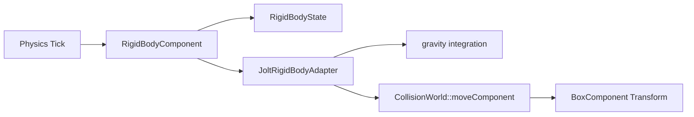

# 물리와 Jolt Adapter

## 목표

v0.9의 물리 단계는 `RigidBodyComponent`와 `JoltRigidBodyAdapter` 경계를 만든다. 현재
구현은 Jolt 라이브러리를 직접 링크하지 않고, 기존 AABB collision을 사용해 중력과
속도 기반 이동을 재현한다. 중요한 목표는 “강체 컴포넌트가 어떤 API로 물리 backend와
대화하는가”를 먼저 고정하는 것이다.

## 필요한 이유

Jolt 같은 실제 물리 엔진은 shape, body id, broad phase, solver, island 같은 개념이 많다.
초보 단계에서 바로 외부 물리 엔진을 붙이면 엔진 구조보다 라이브러리 사용법이 더 크게
보인다. 그래서 이번 단계에서는 `JoltRigidBodyAdapter`라는 이름의 교체 지점을 만들고,
나중에 Jolt를 연결할 때 `RigidBodyComponent`의 공개 API를 크게 바꾸지 않도록 한다.

## 핵심 타입

- [`RigidBodyComponent`](../../include/engine/Gameplay.hpp): Actor의 `BoxComponent`를 dynamic body처럼 움직인다.
- [`RigidBodyState`](../../include/engine/Systems.hpp): velocity, mass, dynamic, gravity, grounded 상태를 가진다.
- [`JoltRigidBodyAdapter`](../../include/engine/Systems.hpp): Jolt 교체 지점이다. 현재는 자체 AABB 이동을 사용한다.
- [`CollisionWorld`](../../include/engine/Systems.hpp): 실제 이동 차단과 grounded 판정을 위한 AABB query를 제공한다.

## 흐름도

## 코드 따라가기

1. [`Gameplay.hpp`](../../include/engine/Gameplay.hpp)의 `RigidBodyComponent` 공개 API를 읽는다.
2. [`Gameplay.cpp`](../../src/Gameplay.cpp)의 `RigidBodyComponent::tickComponent`에서 owner의 `BoxComponent`를 찾는 흐름을 본다.
3. [`Systems.cpp`](../../src/Systems.cpp)의 `JoltRigidBodyAdapter::integrate`에서 중력, delta 이동, 막힌 축 velocity 제거를 확인한다.
4. [`Reflection.cpp`](../../src/Reflection.cpp)에서 `Velocity`, `Mass`, `Dynamic`, `GravityEnabled`가 저장 가능한 property로 등록되는지 본다.
5. [`Application.cpp`](../../src/Application.cpp)의 `createDemoWorld`에서 `Physics Crate`가 데모 월드에 추가되는지 확인한다.

## 실험 과제

`Physics Crate`의 `Velocity`를 `{300, 0, 0}`으로 설정하고 PIE를 시작해 바닥 위에서 옆으로
움직이는지 확인한다. `GravityEnabled`를 끄면 crate가 공중에 멈추는지도 확인해 볼 수 있다.

## 흔한 실수

- `RigidBodyComponent`만 붙이고 `BoxComponent`가 없으면 움직일 shape가 없다.
- 현재 adapter는 회전 강체, 마찰, 반발, 관성 텐서를 구현하지 않는다.
- Jolt를 직접 링크한 상태가 아니다. 실제 Jolt 연결은 이 adapter 내부를 교체하는 다음 단계다.
- 큰 delta time에서는 AABB 이동이 실제 continuous physics처럼 정확하지 않다.

## 관련 테스트

[`EngineTests.cpp`](../../tests/EngineTests.cpp)의 `testRigidBodyAdapterFallsAndBlocks`는
중력으로 떨어진 body가 바닥에 막히고 vertical velocity를 지우는지 확인한다.
`testRigidBodyReflectionSerialization`은 velocity, mass, gravity 설정이 World JSON에
보존되는지 확인한다.
