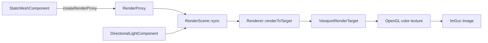

# 렌더링

## 목표

게임 객체가 OpenGL을 직접 호출하지 않고 화면에 그려지는 데이터 흐름을 이해한다.

## 필요한 이유

게임 로직과 그래픽 API가 섞이면 테스트하기 어렵고 렌더 구조를 바꾸기 힘들다.
Component의 상태를 값 데이터로 복사하면 두 영역의 책임이 선명해진다.

## 핵심 타입

- [`PrimitiveComponent`](../../include/engine/Components.hpp): 렌더 가능한 Component 기반
- [`StaticMeshComponent`](../../include/engine/Components.hpp): 현재 큐브 proxy 생성
- [`RenderProxy`](../../include/engine/RenderTypes.hpp): 렌더러용 불변 값 묶음
- [`RenderScene`](../../include/engine/Systems.hpp): proxy와 revision 관리
- [`Renderer`](../../include/engine/Renderer.hpp): OpenGL 리소스와 draw call
- [`ViewportRenderTarget`](../../include/engine/Renderer.hpp): color/depth framebuffer
- [`DirectionalLightComponent`](../../include/engine/Components.hpp): 방향성 조명 값
- [`CameraView`](../../include/engine/RenderTypes.hpp): view/projection 입력

## 흐름도

## 코드 따라가기

1. [`Components.cpp`](../../src/Components.cpp)의
   `StaticMeshComponent::createRenderProxy`를 읽는다.
2. 프로퍼티 setter가 `markRenderStateDirty`를 호출하는지 확인한다.
3. [`Systems.cpp`](../../src/Systems.cpp)의 `RenderScene::sync`에서 revision 비교를
   찾는다.
4. [`Renderer.cpp`](../../src/Renderer.cpp)의 `ViewportRenderTarget::resize`에서
   color texture와 depth renderbuffer가 Viewport 크기에 맞춰지는지 확인한다.
5. `RenderScene::sync`에서 `DirectionalLightComponent`가 light proxy로 모이는지
   확인한다.
6. `Renderer::renderToTarget`에서 장면과 선택 wireframe을 off-screen target에
   그리는 순서를 읽는다.
7. [`Application.cpp`](../../src/Application.cpp)의 `drawViewportPanel`에서
   color texture가 `ImGui::Image`로 표시되는지 확인한다.
8. [`basic.vert`](../../shaders/basic.vert)와
   [`basic.frag`](../../shaders/basic.frag)에서 GPU 단계의 입력을 확인한다.

## 실험 과제

Viewport 패널 너비를 드래그해 framebuffer 크기가 바뀌는지 확인한다. 그 뒤 큐브
색을 바꾸고 `RenderScene`의 갱신 횟수가 한 번만 늘어나는지 확인한다.

## 흔한 실수

- Component에서 OpenGL 함수를 직접 호출한다.
- 렌더에 영향을 주는 값을 바꾸고 revision을 올리지 않는다.
- RenderProxy에 Component raw pointer를 넣어 수명을 다시 결합한다.
- cm 단위 World 값과 projection의 near/far 값을 맞추지 않는다.
- 선택 wireframe과 grid에도 조명을 적용해 디버그 색이 읽기 어려워진다.
- framebuffer를 다시 화면 framebuffer로 unbind하지 않아 ImGui도 target에 그린다.
- OpenGL 원점이 왼쪽 아래라는 점을 잊어 Viewport나 PNG가 상하로 뒤집힌다.

## 관련 테스트

[`EngineTests.cpp`](../../tests/EngineTests.cpp)의
`testRenderProxyDirtyUpdate`가 변경된 Component의 proxy만 한 번 갱신되는지
확인한다. `testDirectionalLightProxy`는 조명 값이 렌더 장면에 복사되는지 확인한다.
`testPngWriter`는 RGBA readback의 상하 방향 규칙을 확인한다.
