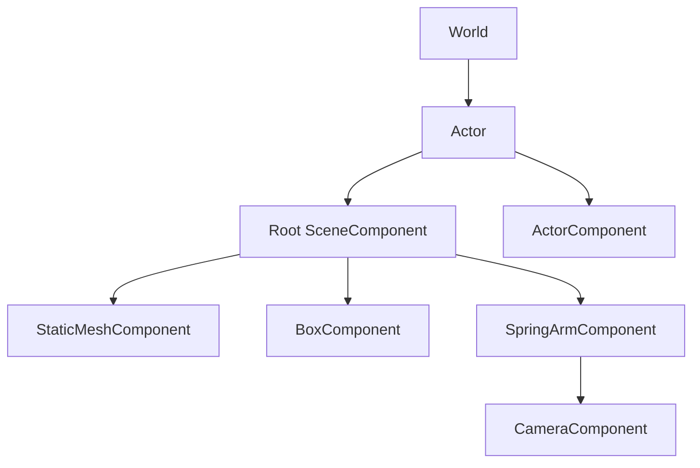

# World, Actor, Component

## 목표

객체의 소유권, 생명주기, Transform 계층과 Tick 실행 순서를 이해한다.

## 필요한 이유

게임 객체가 업데이트 도중 생성되거나 사라져도 컨테이너가 깨지지 않아야 한다.
또 카메라, 메시, 충돌 영역을 Actor에 조합하면서 위치는 한 계층으로 계산해야 한다.

## 핵심 타입

- [`World`](../../include/engine/World.hpp): Actor와 시스템의 실행 공간
- [`Actor`](../../include/engine/World.hpp): Component 소유 컨테이너
- [`ActorComponent`](../../include/engine/World.hpp): 생명주기와 Tick의 기본 단위
- [`SceneComponent`](../../include/engine/World.hpp): Transform과 attachment

## 흐름도

## 코드 따라가기

1. [`World.hpp`](../../include/engine/World.hpp)의 상속과 소유 컨테이너를 비교한다.
2. [`World.cpp`](../../src/World.cpp)의 `SceneComponent::attachTo`에서 순환
   attachment 거부를 확인한다.
3. `Actor::finishSpawning`에서 construction, component 등록, BeginPlay 순서를
   읽는다.
4. `World::tick`에서 Tick 그룹과 예약된 변경 반영 위치를 찾는다.
5. `World::destroyActor`와 `World::flushDeferredChanges`에서 지연 삭제 이유를
   살펴본다.

## 실험 과제

Actor 하나에 Root, 자식, 손자 SceneComponent를 만든다. Root를 100cm 이동한 뒤
각 World 위치를 출력하고 부모 Transform이 어떻게 더해지는지 확인한다.

## 흔한 실수

- Actor가 Transform을 직접 가진다고 생각한다.
- `attachTo`의 반환값을 확인하지 않아 순환 연결 실패를 놓친다.
- Tick이 기본 활성화라고 가정한다.
- Tick 도중 raw pointer만 보관하고 Actor 삭제를 즉시 기대한다.
- Component 객체 소유와 attachment 부모 관계를 같은 것으로 생각한다.

## 관련 테스트

[`EngineTests.cpp`](../../tests/EngineTests.cpp)의 `testAttachmentAndCycle`이
World Transform과 순환 attachment 거부를 확인한다. 생명주기를 바꿀 때는
Tick 중 spawn/destroy 테스트를 함께 보강해야 한다.
